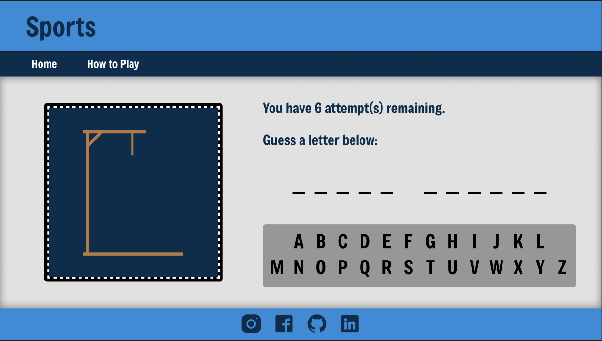

# Hangman

## 📚 Table of Contents

- [Project Overview](#-project-overview)
- [Live Demo](#-live-demo)
- [Tech Stack](#-tech-stack)
- [Project Structure](#-project-structure)
- [Installation](#%EF%B8%8F-installation)
- [Usage](#%EF%B8%8F-usage)
- [Next Steps](#-next-steps)
- [Credits](#-credits)

## 🧠 Project Overview

Source code for my own personal, web-based version of the game **_Hangman_**. In the game, players must correctly guess the letters of a given mystery word within 6 attempts. There are 8 available themes of words/phrases for players to guess:

1. Movies
2. Video Games
3. Sports
4. Idioms
5. TV Shows
6. Food
7. Animals
8. Cities

## 🚀 Live Demo

- Play the game here: [Hangman](https://hangman-web-app-466f2d94c639.herokuapp.com/)
- Initial designs available here: [Figma Designs](https://www.figma.com/design/tOop8Aqlh0zycbjdERI0Ut/Hangman?node-id=0-1&t=uR8s9pxzcX4Zwzt0-1)

**Gameplay example:** Guess the letters of the mystery sport below (6 attempts).



## 💻 Tech Stack

- **Frontend:** React (Vite), CSS, ESLint
- **Backend:** Node.js, Express.js
- **Database:** MongoDB

## 📁 Project Structure

```
hangman-web-app/
├── client/              # React frontend
│   ├── src/
│   │   ├── assets/        # Static assets
│   │   ├── components/    # React components
│   │   ├── layouts/       # Page layouts
│   │   ├── pages/         # Page components
│   │   ├── services/      # API calls to backend
│   │   ├── styles/        # CSS files for styling
│   │   ├── utils/         # Helper functions
│   │   ├── App.jsx
│   │   └── main.jsx
│   ├── index.html
│   ├── package.json
│   └── vite.config.js     # Vite configuration
│
├── server/              # Node/Express backend
│   ├── config/            # Database configuration
│   ├── controllers/       # APIs for game logic/routing
│   ├── routes/            # Express app routes
│   ├── app.js             # Express app setup
│   └── package.json
│
├── .gitignore
├── .prettierignore
├── package.json         # Project-wide scripts
└── README.md
```

## ⚙️ Installation

**NOTE:** In order to actually run this project locally, you would need access to the database (which is not provided here). This is meant to be my own personal project, but I will still give setup instructions below.

1. Clone the repository

```
git clone https://github.com/jawuanlewis/hangman-web-app.git
```

2. Install dependencies

```
cd hangman-web-app
npm install
```

3. Set up environment variables

Create a .env file in the root directory that contains the following variables:

- **SESSION_SECRET:** can be any random, secret string
- **MONGO_URI:** uri to the MongoDB database
- **DB_NAME:** the database name

4. Run the development server

```
npm run dev
```

## ▶️ Usage

Once the application is running, you can:

1. Navigate to `http://localhost:5173` in your browser.
2. Start by choosing a level to play.
3. A mystery word will be displayed, along with a keyboard of letters to guess.
4. Guess letters until you either fully reveal the word or lose all 6 attempts.
5. You can either play the same theme/level again or return to the main menu to choose a new one!

## 🔮 Next Steps

**Resource Changes:**

- Migrate from React to Redux for state management.
- Migrate from Express Sessions to MongoDB (or some resource) for managing game data.

**Future Features:**

- Add a main game page, with no particular theme and an increasing level of difficulty with each word.
- Generate small hints each time the user guesses incorrectly (potentially using OpenAI API).
- Add a multiplayer page.
- Add a "How to Play" page.

## 🙏 Credits

- **Social Media Icons:** [Icons8](https://icons8.com)
- **Level Images:** generated with [ImageFX](https://labs.google/fx/tools/image-fx)
